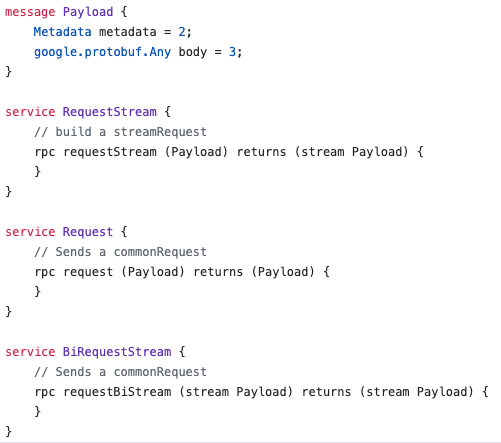
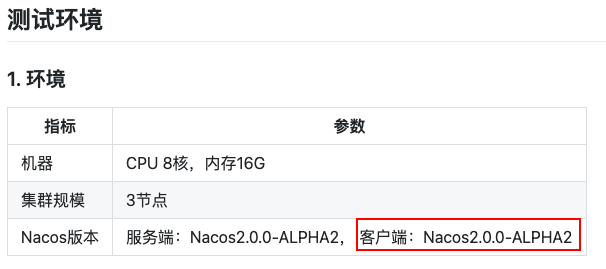

# nacos-jmh

## 1. Background

想对nacos做个性能测试，由于 nacos2.0 通信默认使用 grpc —— 长连接方式。通过调研目前市面上支持 grpc 测试工具有 [ghz](https://github.com/bojand/ghz)、[grpcurl](https://github.com/fullstorydev/grpcurl) 、[jmeter-grpc-plugin](https://github.com/zalopay-oss/jmeter-grpc-plugin) 等，它们都支持通过配置*.proto文件，然后再传入相应的请求内容，就可以访问相应的grpc服务，ghz与jmeter-grpc-plugin可以进行压测。

**遇到的问题：** nacos 的proto文件 [nacos_grpc_service.proto](https://github.com/alibaba/nacos/blob/2.0.0/api/src/main/proto/nacos_grpc_service.proto) ，在使用 ghz 与 jmeter-grpc-plugin工具进行压测时，需要构建相应的请求内容，由于 nacos 的rpc 请求没有细化到具体业务，构造 Payload 的 message 时遇到了比较大的困难——**构建请求体。**

后面发现 [JMH](https://github.com/openjdk/jmh) (Java Microbenchmark Harness)，只要添加相应的依赖，通过调用 Nacos相应的SDK对其进行测试。Nacos 的 SDK 中只有 JAVA 的 SDK 更新的最快，而且在其性能测试中使用的 Client 也是 JAVA的最新2.0-ALPHA2版本，所以使用 JAVA 的最新 SDK。

## 2. Deployment of Nacos 

参考[nacos官网](https://nacos.io/zh-cn/docs/deployment.html) 。

[Nacos 2.0 服务发现的性能测试](https://nacos.io/zh-cn/docs/nacos2-naming-benchmark.html) 。

[单机部署](https://github.com/robotLJW/nacos-jmh/blob/main/doc/nacos-deployment.md)。

 

