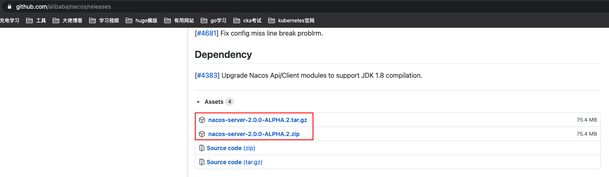
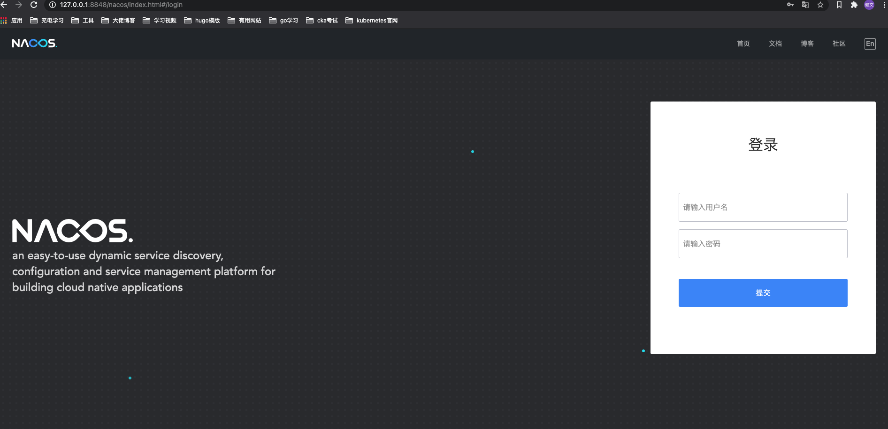
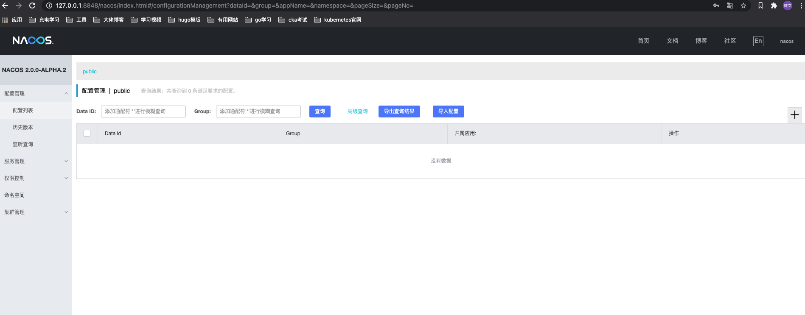

# nacos 部署

> 个人机子用于调试所以只部署单集群模式。

## 1. 下载

Nacos 的 [release notes](https://github.com/alibaba/nacos/releases)。



## 2. 部署

```shell
# 1、下载相应版本的 nacos-server-$version.zip
# 2、解压
tar -xvf nacos-server-$version.tar.gz
# 3、进入目录
cd nacos/bin
# 4、启动服务 —— 单机模式
# Linux/Unix/Mac
sh startup.sh -m standalone
# Windows
cmd startup.cmd -m standalone
```

## 3. 前端页面

> 能打开前端页面表示部署成功。

http://127.0.0.1:8848/nacos/index.html

默认账号以及密码：nacos nacos



